# Образование

В разделе представлены сведения об основном и дополнительном образовании.

## Основное образование

|№ п/п|Учебное заведение|Год окончания|Специальность/специализация|
|-----|-----------------|-------------|---------------------------|
|1|УО Военная Академия Республики Беларусь, факультет связи и АСУ|2007|Инженер по телекоммуникациям|
|2|ИПК и ПК ГГТУ им. П.О. Сухого|2019|Инженер-программист|

## Дополнительное образование (переподготовка, повышение квалификации, курсы, семинары)

<u>**Курс «Системный аналитик», ООО «Нетология» (ноябрь 2023 — сентябрь 2024):**</u>

+ Диплом профессиональной переподготовки +

  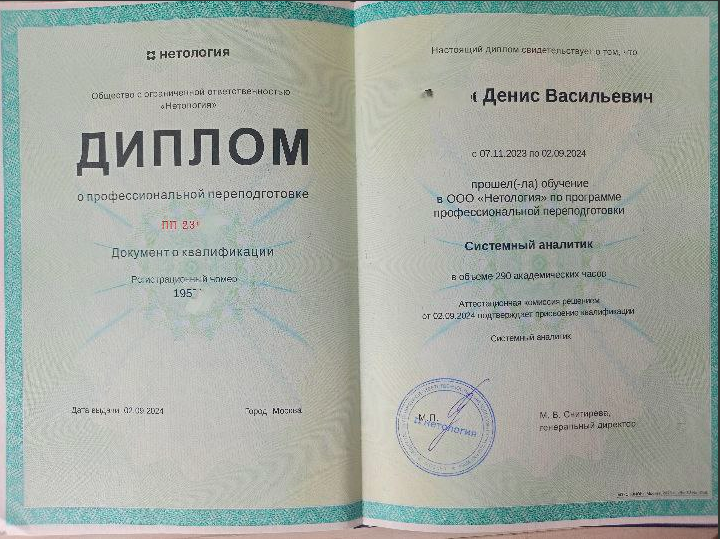

+ Свидетельство о прохождении модуля «Работа в проектной команде по Agile» +

  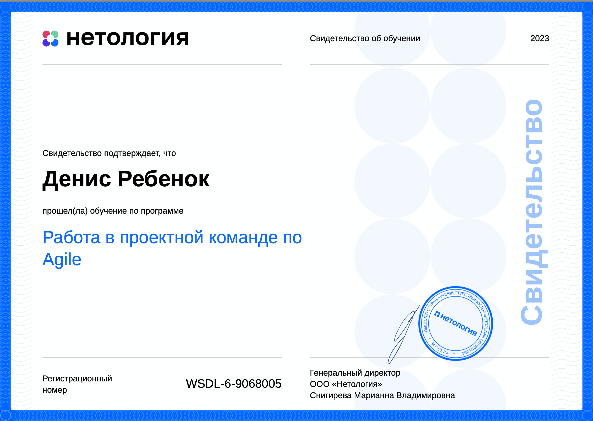

+ Свидетельство о прохождении модуля «Жизненный цикл разработки ПО» +

  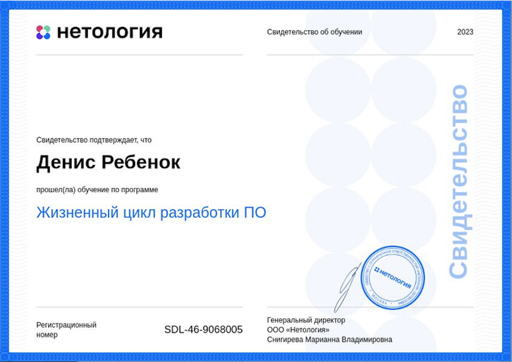

+ Свидетельство о прохождении модуля «Анализ требований» +

  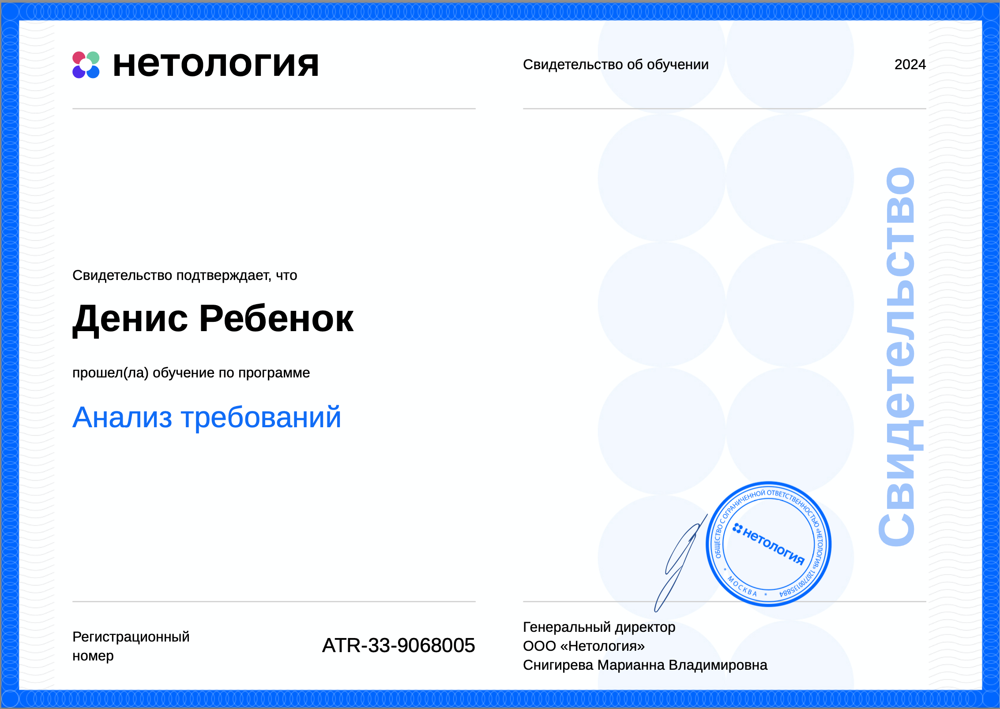

+ Свидетельство о прохождении модуля «Git и механизмы ветвления» +

  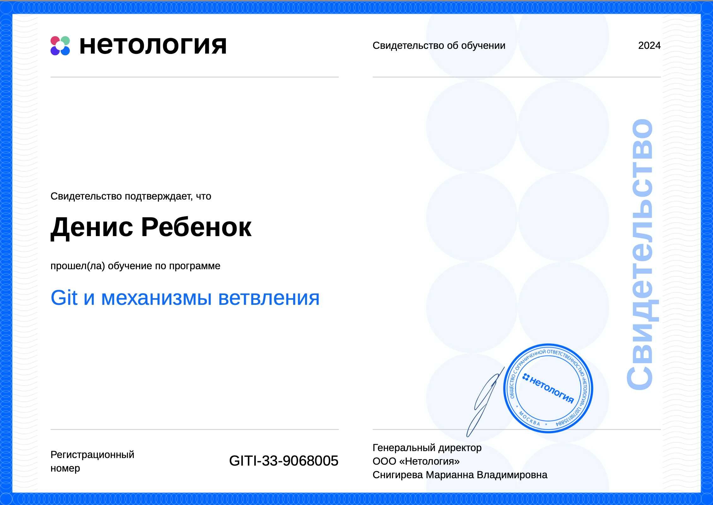

+ Свидетельство о прохождении модуля «SQL и получение данных» +

  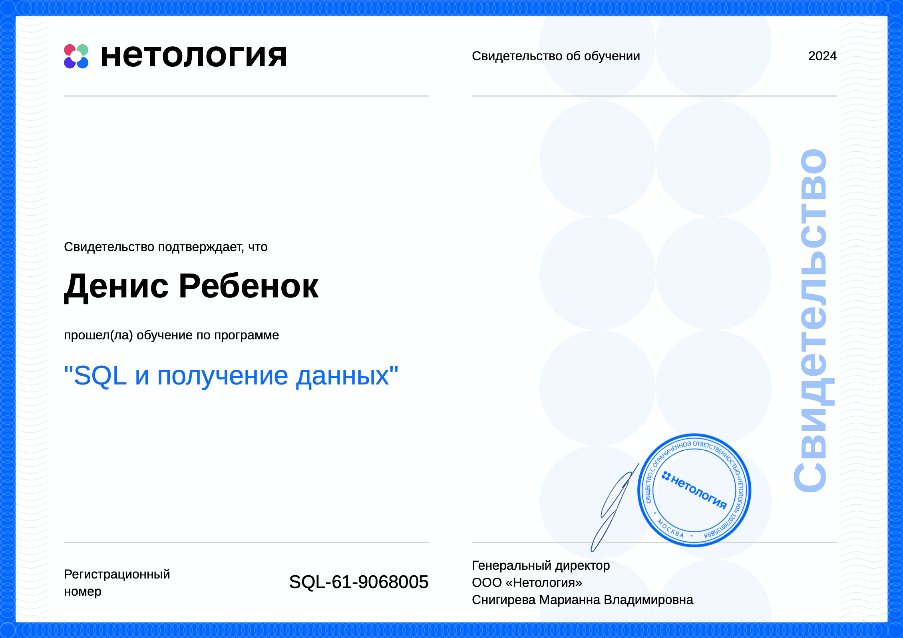

+ Свидетельство о прохождении модуля «Прототипирование интерфейсов» +

  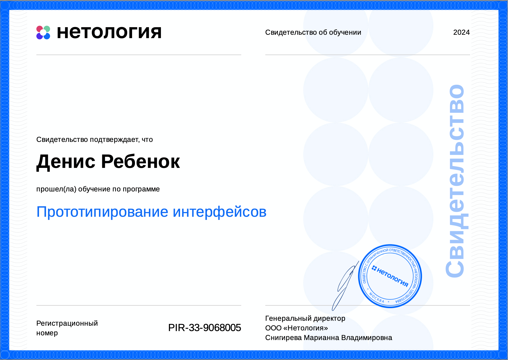

+ Свидетельство о прохождении модуля «Моделирование бизнес-процессов» +

  

+ Свидетельство о прохождении модуля «Интеграция систем и документирование API» +

  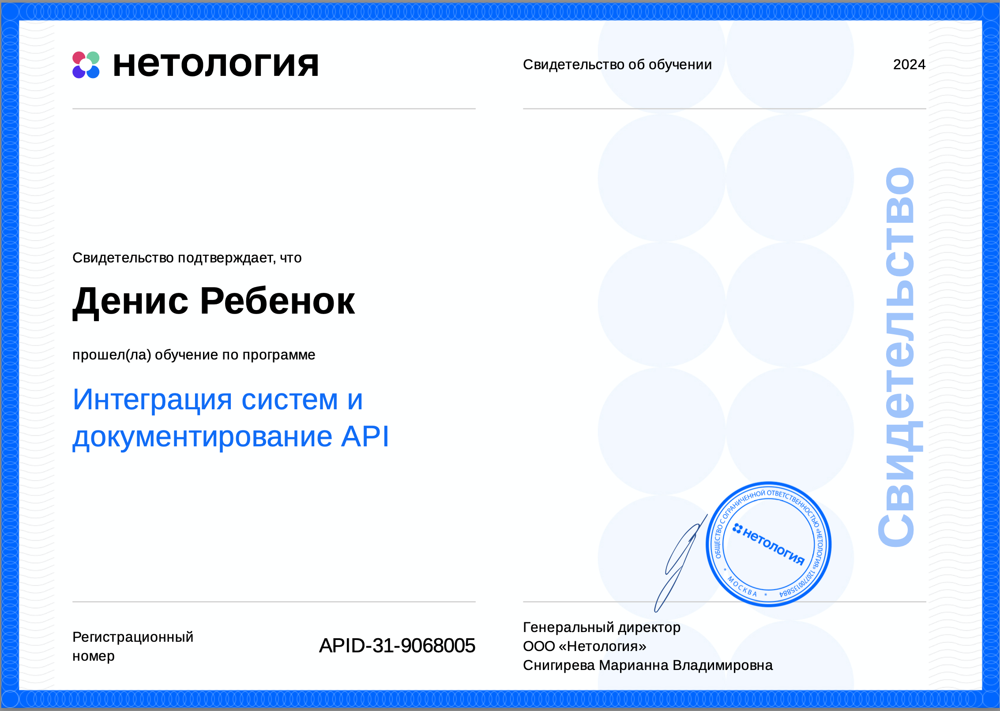

+ Свидетельство о прохождении модуля «Тестирование и развертывание ПО» +

  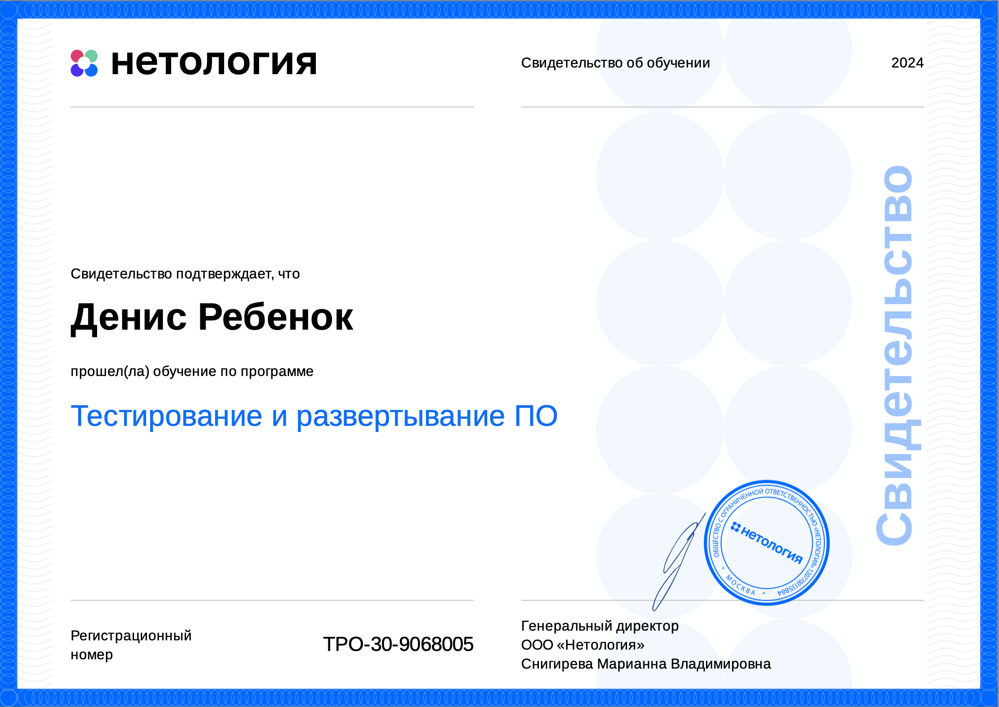

+ Свидетельство о прохождении модуля «Документирование в IT-проектах» +

  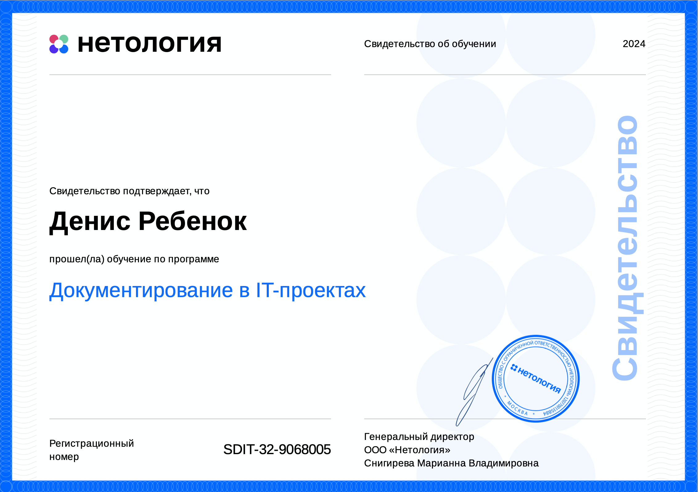

<u>**Курс Grammar for life от Skyeng (март 2023):**</u>

+ Сертификат о прохождении курса +

  

<u>**Курс по технической документации в IT проектах Advanced Technical Writing от Documentat (октябрь 2022):**</u>

+ Сертификат о прохождении курса +

  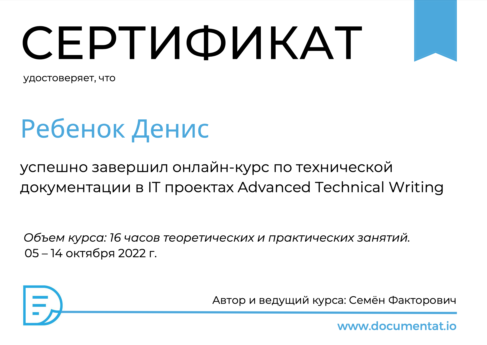

<u>**Курс PRE-ITERMEDIATE ENGLISH от ERASMUS (декабрь 2019 — март 2020):**</u>

+ Сертификат о прохождении курса +

  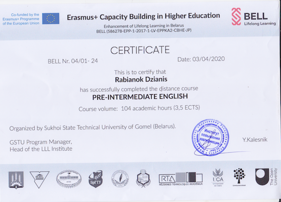
